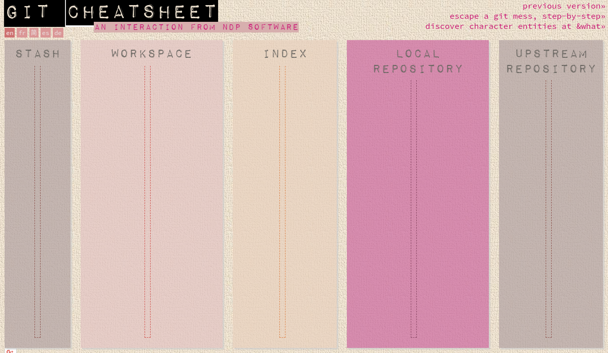

---


---

# Na tych warsztatach:
- przerywajcie i zadawajcie pytania
- nie ma głupich pytań
- MDN(en) lepszy od Stack Overflow, zapomnijcie o w3schools

---

# Omówienie zadań domowych

---

### Zadanie 1


> Które z poniższych elementów HTML są elementami 'inline' a które 'block'.
 
**Block**:  `<header>` `<div>` `<table>` `<canvas>` `<form>` `<h1>` `<ul>`

**Inline**: `<a>` `<input>` `<span>` `<button>` `<strong>` `<label>`

[Block-level_elements @MDN](https://developer.mozilla.org/en-US/docs/Web/HTML/Block-level_elements)

---

### Zadanie 2

> Co nie wpływa na szczegółowość (specificity) selektora CSS?

- **Długość nazw elementów selektora (np. `#krotka-nazwa` vs `#bardzo-bardzo-dluga-nazwa`)**
* **Kolejność umieszczenia w pliku `.css`**
* ~~Typ elementów selektora (znacznik, klasa, identyfikator, pseudoklasa, pseudoelement, atrybut)~~
* ~~Złożoność selektora~~

[Specificity @MDN](https://developer.mozilla.org/en-US/docs/Web/CSS/Specificity)

---

### Zadanie 3 [1/2]
  
> Uzupełnij powyższy kod CSS, aby wyśrodkować w pionie i w poziomie element "#centered".

```css
body {
  height: 100vh;
  margin: 0;
  display: flex;
  align-items: center;
  justify-content: center;
}

#centered {
  background-color: #00aa00;
}
```

[Flexbox guide @css-tricks](https://css-tricks.com/snippets/css/a-guide-to-flexbox/)

---

**lub**

```css
body {
  height: 100vh;
  margin: 0;
}

#centered {
  background-color: #00aa00;
  position: absolute;
  left: 50%;
  top: 50%;
  transform: translate(-50%, -50%);
}
```
[transform @MDN](https://developer.mozilla.org/en-US/docs/Web/CSS/transform)

---

### Zadanie 4

```js
const myList = [1,2,3];
myList.forEach(item => {
  console.log(item);
});
```

> Przepisz powyższy kod z wykorzystaniem pętli `for`

```js
for(var i = 0; i < myList.length; i++){
  console.log(myList[i]);
}
```

> Przepisz powyższy kod z wykorzystaniem pętli `while`

```js
var i = 0;
while(i < myList.length){
  console.log(myList[i]);
  i++;
}
```

[JS reference @MDN](https://developer.mozilla.org/en-US/docs/Web/JavaScript/Reference#Iterations)

---

### Zadanie 5
> Co zostanie wypisane na konsoli?

```js
console.log(1 +  "2" + "2");    // "122"
console.log(1 +  +"2" + "2");   // "32"
console.log(1 +  -"1" + "2");   // "02"
console.log(+"1" +  "1" + "2"); // "112"
console.log("A" - "B" + "2");   // "NaN2"
console.log("A" - "B" + 2);     // NaN
```

[Arithmetic_Operators @MDN](https://developer.mozilla.org/en-US/docs/Web/JavaScript/Reference/Operators/Arithmetic_Operators)

---

### Zadanie 6
> Co zostanie wypisane na konsoli?
```js
var x = 30;
var age = function () {
    console.log(x);
    var x = 40;
};
age ();

// undefined
```

[Hoisting @MDN](https://developer.mozilla.org/en-US/docs/Glossary/Hoisting)

---

#### Zadanie 7

> Napisz funkcję, która przyjmuje tablicę liczb i zwraca posortowaną tablicę, zawierającą tylko elementy będące parzystymi liczbami całkowitymi.
> Przykład:
f([1.2, 5, 8, 3, 2])  -->  [2, 8]


```js
function sortedEven(arr){
  return arr
    .filter(v => v % 2 === 0)  // create new array
    .sort((a,b) => a - b);     // sort in place
}
```
[Array reference @MDN](https://developer.mozilla.org/en-US/docs/Web/JavaScript/Reference/Global_Objects/Array#Iteration_methods)

---
#### Zadanie 8 [1/2]
<span style="font-size:19px">

> Jakie błędy popełnił programista pisząc powyższą klasę? 
> Zwróć uwagę na błędy merytoryczne, nie szukaj literówek;   Błędów jest przynajmniej 5;


```js
const emptyList = [];

class ClickCounter {
    constructor(){
        this.counter = 0;
        this.observedElements = emptyList;       // 1. The same list for each instance
    }    

    observe(el){
        this.observedElements.push(el);
        el.addEventListener('click', function(){
            this.counter++;                      // 2. 'this' is the el,
        });                                      // not ClickCounter instance 
    }

    stop(el){
        let idx = this.observedElements.indexOf(el);
        this.observedElements.splice(idx, 1);
                                                // 3. missing 'removeEventListener' 
    }

    stopAll(){                                  // 4. 'stop' modifies the array, 
                                                // loop is broken
        for(i = 0; i < this.observedElements.length; i++){ // 5. `i` is global
            this.stop(this.observedElements[i]);
        }
    }

    resetCounter(){
        counter = 0;                             // 6. this.counter
    }
}
```
</span>


---
#### Zadanie 8 [2/2]
<span style="font-size:18px">

> Przepisz całą klasę z poprawionymi błędami.

```js
class ClickCounter {
    constructor(){
      this.counter = 0;
      this.observedElements = [];
      this.clickHandler = this.clickHandler.bind(this);  
    }
    
    clickHandler(){
      this.counter++;
    }

    observe(el){
      this.observedElements.push(el);
      el.addEventListener('click', this.clickHandler);
    }

    stop(el){
        let idx = this.observedElements.indexOf(el);
        if(idx === -1) return;
        this.observedElements.splice(idx, 1);
        el.removeEventListener('click', this.clickHandler);
    }

    stopAll(){
        for(const el of this.observedElements){
          el.removeEventListener('click', this.clickHandler);
        }
        this.observedElements.length = 0;
    }

    resetCounter(){
        this.counter = 0;
    }
}
```
[this in JS @MDN](https://developer.mozilla.org/en-US/docs/Web/JavaScript/Reference/Operators/this)
</span>


---
#### Zadanie 9
> Stwórz obiekt klasy ClickCounter (z poprzedniego zadania) zliczający kliknięcia w komórki (td) wszystkich tabel jakie znajdują się w dokumencie. 

```js
const clickCounter = new ClickCounter();
document.querySelectorAll('td').forEach(el => {
  clickCounter.observe(el);
});
```

> Czy kliknięcia w komórki stworzone po zainicjowaniu obiektu będą zliczane?

*Nie będą :)*

---

# Składowe projektu front-end

---

# Kiedyś było prosto

```html
<!DOCTYPE html>
<head>
  <meta charset="utf-8">
  <title>Hello</title>
</head>

<body>
  <div id="main"></div>
  <script 
    src="https://code.jquery.com/jquery-2.2.4.min.js"
  ></script>
  <script>
    $('#main').html('Hello world!');
  </script>
</body>
</html>

```

---

## Składowe Współczesnego projektu front end [1/2]

Ciekawe zestawienie: https://stateofjs.com/2017/introduction/

- System kontroli wersji (**Git**)
- Manager pakietów (**Npm** / Yarn)
- Module bundler (**Webpack**)
- JS Flavor transpiler (**Babel** / Typescript) + polyfills
- JS Framework / UI Lib  (**React** / Vue / Angular)
- JS state management lib (Redux / **MobX** / Vuex)
- CSS preprocessor (**Sass** / Less)

---

## Składowe Współczesnego projektu front end [2/2] 
- Code linters (ESLint)
- Test framework (Mocha / Jasmine / Jest)  

- Automatyczne testy w przeglądarkach  
  (Karma / Selenium)
- Utility Libraries (Lodash / Moment / ... )
- Static type checker (Flow / (Typescript) )
- Error tracking (Sentry)
- CSS Framework (Bootstrap  / ...)

---

# Git - System kontroli wersji [1]

### Konfiguracja
```
git config --global user.name "Jan Nowak"
git config --global user.email jannowak@example.com
git config --global core.editor vim
```

### Konfiguracja klucza SSH
[GitHub Help](https://help.github.com/articles/generating-a-new-ssh-key-and-adding-it-to-the-ssh-agent/)
```
ssh-keygen -t rsa -b 4096 -C "your_email@example.com"
```

---

## Git - System kontroli wersji [2]
[Git cheatsheet @ndpsoftware.com](http://ndpsoftware.com/git-cheatsheet.html)



---

## Git - System kontroli wersji [3]
Tworzenie nowego repozytorium:
```bash
git init
git add .
git commit -m "Initial commit"
git remote add origin <url>
git push -u origin master
```
Praca na istrniejącym repozytorium
```bash
git clone <url>
```

---

## Git - System kontroli wersji [4]
Najczęściej używane komendy [1]
```bash
workspace <--> index
> status
> diff
> add
> checkout -- <path>

workspace <--> local_repo
> checkout
> reset --hard

workspace <--> remote_repo
> pull

```

---

## Git - System kontroli wersji [5]
Najczęściej używane komendy [2]
```bash
index <--> local_repo
> commit -m "message"
> commit --amend

local_repo <--> remote_repo
> fetch
> push

```

---

## Git - System kontroli wersji [6]

Praca z *branch'ami*
[Git docs](https://git-scm.com/book/en/v2/Git-Branching-Basic-Branching-and-Merging)

---

# Ćwiczenie

1. 
* Zaloguj / zarejestruj się na https://github.com/
* Skonfiguruj git'a (name, email, klucz ssh)
* Dodaj swój klucz SSH na `GitHub`
* Stwórz nowe repozytorium  z plikiem `README.md`. I wrzuć wszystko na `GitHub`.

2.
* Zrób *fork'a* naszego *boilerplate'u* (przez interface `GitHub`) https://github.com/mkaczkowski/daftcode-react-starter
* Pobierz repozytorium na swój komputer (`git clone`)
* *Zapoznaj się z projektem*

---

# Omówienie *boilerplate'u*
- `git`, `.gitignore`
- `npm`, `package.json` [docs](https://docs.npmjs.com/files/package.json)
- `src`
- `webpack.config.js`, `webpack.config.prod.js` [docs](https://webpack.js.org/configuration/)
- `.babelrc` [docs](https://babeljs.io/docs/usage/babelrc/)
- `.eslintrc` [docs](https://eslint.org/docs/user-guide/configuring)


---