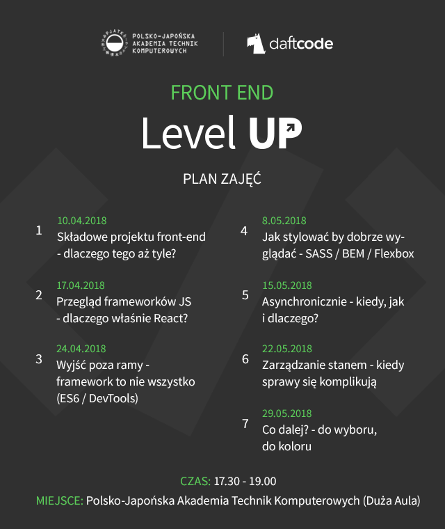

# Front End Level UP


# Plan zajęć



# Informacje organizacyjne

https://www.facebook.com/events/1705112642901696

# Instalacja środowiska przed zajęciami

1. Node.js: https://nodejs.org/en/download/

2. Konsola (linux-like) z zainstalowanym git'em
**Linux/MaxOS:** https://git-scm.com/downloads
**Windows:** polecamy http://cmder.net/  (od razu konsola razem z git'em)

3. Nowoczesny edytor / IDE. Jeśli nie masz swojego ulubionego to polecamy:
 - https://code.visualstudio.com/
 - https://atom.io/
 - https://www.sublimetext.com/

Po instalacji sprawdź, czy wszystko zostało poprawnie zainstalowane.
W konsoli napisz:
```sh
git --version
node --version
npm --version
```

# Przykładowa aplikacja *(boilerplate)*

W tracie zajęć (w ramach prac domowych) będziecie rozwijać własną aplikcaję, którą umieścicie online przy użyciu [GitHub Pages](https://pages.github.com/).

Prowadzący przygotowali *boilerplate*, na którym możecie się wzorować.
### https://github.com/mkaczkowski/daftcode-react-starter


W głównym repozytorium kursu znajduje się również [przykładowa aplikacja](sample_app), która została stworzona na bazie wspomnianego *boilerpate'u* i będzie rozwijana w trakcie kursu przez prowadzących. Działającą wersję aplikacji znajdziecie na *GitHub Pages* tego repozytorium.
### https://daftcode.github.io/frontend_levelup_2018/

# Pomoc przy pracach domowych, pytania dotyczące treści zajęć

Zachęcamy do zadawania pytań przez [Issues](https://github.com/daftcode/frontend_levelup_2018/issues) tego projektu. Przeglądajcie również pytania innych uczestników, może potraficie na nie odpowiedzieć! :D

# Materiały z zajęć

*Tutaj dzień po zajęciach znajdziecie prezentacje oraz treść zadań domowych.*

1. [Składowe projektu front-end](./01_skladowe_projektu_frontend.md) ([ZADANIE DOMOWE](./01b_zadanie_domowe.md))
2. [Przeglad frameworków; React (pdf)](./02_przeglad_frameworkow_React.pdf) ([ZADANIE DOMOWE](./02b_zadanie_domowe.md))
